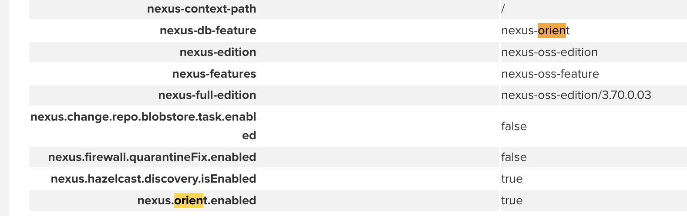
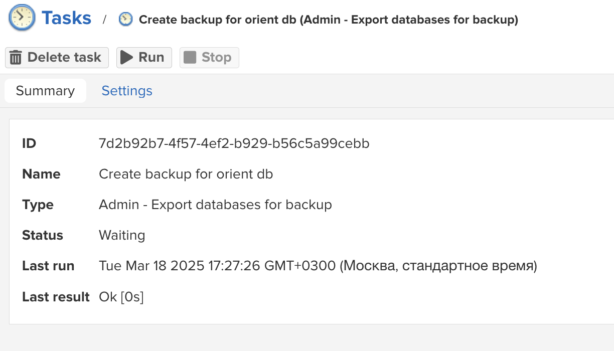
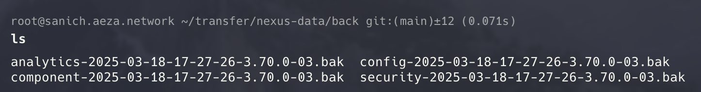
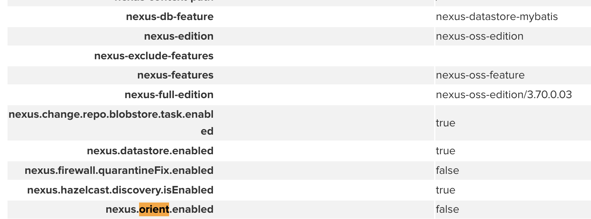
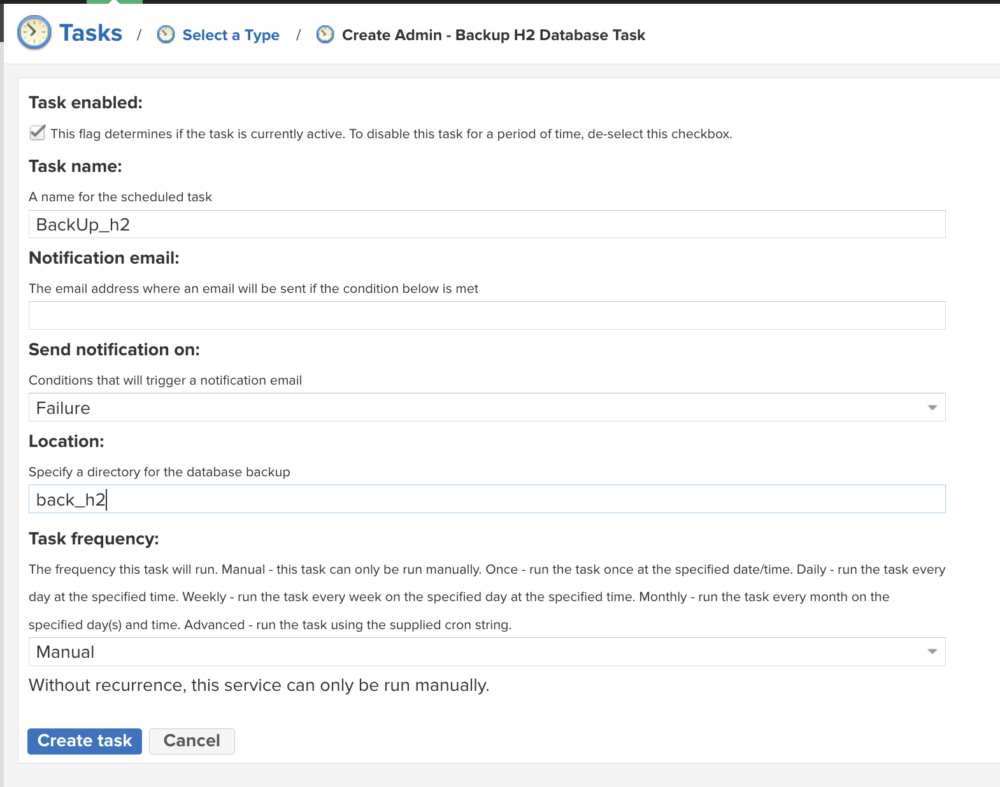
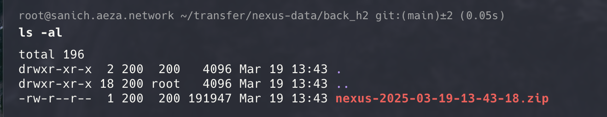

## 1. Миграция с Orient на H2

__Важно! Миграция с плагинами не возможна!__
> Репозитории с плагинами отвалятся, а сами плагины не дадут вам запустить контейнер с нексусом, поэтому удалите ваши плагины из волумов!

Orient поддерживается до версии Nexus 3.70.0.

Проверить тип базы данных можно во вкладке `Support` &#8594; `System information` 

Поле `nexus.orient.enabled - true` указывает на тип используемой базы данных



Для старта миграции небоходимо выполнить бекап текущей базы данных

Во вкладке `System`  &#8594; `Task` нербходимо создать задачу `Admin - Export database for backup`
И заполнить следующим образом


`Backup location:` - указывается относительный путь, слeдоватьельно бекапы будут распологаться по следующему пути - `$data-dir/back`

Далее необходимо запустить созданную задачу
Если все сделано верно, то после нажатия на кнопку `RUN`, строка `Last result` - выведет сообщение *Ok*



В указанной директории будут созданы следующие файлы


Теперь необходимо скачать утилиту миграции в папку с __бекапами__ 
Мигратор можно скачать [тут](https://help.sonatype.com/en/orientdb-downloads.html#database-migrator-utility-for-3-70-x) или же: 

```bash
wget https://download.sonatype.com/nexus/nxrm3-migrator/nexus-db-migrator-3.70.4-02.jar
```

__Так же на момент миграции Java должна бы быть 8 версии!__

Перед началом миграции следует выключить контейнер и запускать мигратор из папки с `.bak` файлами

Миграция запускаеться следующей командой:

```bash
java -Xmx16G -Xms16G -XX:+UseG1GC -XX:MaxDirectMemorySize=28672M -jar nexus-db-migrator-*.jar --migration_type=h2
```

> Для слабых серверов/ПК
```bash 
java -Xmx4G -Xms4G -XX:+UseG1GC -XX:MaxDirectMemorySize=16672M -jar nexus-db-migrator-*.jar --migration_type=h2
```

Если все сделано верно, то будет следующий вывод:

```log
18:16:39 [main] INFO  c.s.n.d.m.l.ProvidingJobInfoListener - Migration job finished at Tue Mar 18 18:16:39 MSK 2025
18:16:39 [main] INFO  c.s.n.d.m.l.ProvidingJobInfoListener - Migration job took 2 seconds to execute
18:16:39 [main] INFO  c.s.n.d.m.l.ProvidingJobInfoListener - 49 records were processed
18:16:39 [main] INFO  c.s.n.d.m.l.ProvidingJobInfoListener - 3 records were filtered
18:16:39 [main] INFO  c.s.n.d.m.l.ProvidingJobInfoListener - 0 records were skipped
18:16:39 [main] INFO  c.s.n.d.m.l.ProvidingJobInfoListener - 46 records were migrated
18:16:39 [main] INFO  c.s.n.d.m.l.ProvidingJobInfoListener - Created 'Rebuild repository browse' and 'Rebuild repository search' tasks. They will automatically one-time run after starting your Nexus Repository instance.
18:16:39 [main] INFO  c.s.n.d.m.l.ProvidingJobInfoListener - Migrated the following formats: [APT, COCOAPODS, CONAN, CONDA, DOCKER, GITLFS, GO, HELM, MAVEN2, NPM, NUGET, P2, PYPI, R, RAW, RUBYGEMS, YUM]
```

После миграции создаеться файл `nexus.mv.db` - его необходимо перенести в `$data-dir/db`

Так же необходимо поправить права командой 

```bash
sudo chown 200:200 db/ -R
```

Далее добавим в файл `$data-dir/etc/nexus.properties` строчку:
```bash 
nexus.datastore.enabled=true
```

Запускаем контейнер и проверям тип базы данных



---

## 2. Обновление до Community Edition

С версии 3.77 - OSS переименовлаи в Community Edition, в ней теперь и поддерживаються вшнешние базы Postgres и репо Composer

__Набитые мною шишки:__
> При обновлении нексуса до 3.77 откатиться на версию 3.76 и ниже будет не возможно, так как 3.77 имеет свою схему бд, пожалуйста, помните об этом и сделайте бекап

> Поскольку на 3.76 использовать postgresql нельзя, то миграцию возможно проводить тольок с 3.77. Поэтому на момент обновления до 3.77 в файле `docker-compose.yaml` - должны отсуствовать все помниания postgres (переменные окружения и сам контейнер), иначе nexus, будет пытаться самостоятельно переключиться на нее, от чего контейнер будет падать

> После обновленя до версии 3.77 окно входа попросит достать пароль из файла `admin.password`.
Как описанно в самой [документации](https://help.sonatype.com/en/ce-onboarding.html) при первом запуске будет открыто заного окно приветствия, поэтому ваш страый пороль будет сохранен и вводить нужно будет именно его!

Обновление происходит путем изменения версии в файле `docker-compose.yaml`

```yaml
 nexus:
    image: sonatype/nexus3:3.70.0 # Текущая версия
    restart: unless-stopped
    container_name: nexus
    volumes:
      - ./nexus-data:/nexus-data
    ports:
      - "9090:8081"
      - "8082:8082"
    environment:
      - INSTALL4J_ADD_VM_PARAMS=-Xms1024m -Xmx2048m -XX:MaxDirectMemorySize=2g -Djava.util.prefs.userRoot=/nexus-data
    networks:
      - minio-net  
```
В поле `image` - измените версию на 3.77.0

Должен получится следующий файл:

```yaml
 nexus:
    image: sonatype/nexus3:3.77.0 # Версия Community Edition
    restart: unless-stopped
    container_name: nexus
    volumes:
      - ./nexus-data:/nexus-data
    ports:
      - "9090:8081"
      - "8082:8082"
    environment:
      - INSTALL4J_ADD_VM_PARAMS=-Xms1024m -Xmx2048m -XX:MaxDirectMemorySize=2g -Djava.util.prefs.userRoot=/nexus-data
    networks:
      - minio-net 
```

Теперь перезапускем контейнеры командой

```bash
docker compose up -d
```
Готово, вы перешли на версию 3.77

---

## 3. Миграция на PostgreSQL

>[Инструкция с оффициальной документации](https://help.sonatype.com/en/migrating-to-a-new-database.html#migrating-from-h2-to-postgresql)

Для начала необходимо завести задачу `Create Admin - Backup H2 Databases Task`



После выполнения должен будет появиться файл



Далее нужно скачать [мигратор](https://help.sonatype.com/en/download.html#download-nexus-repository-database-migrator) с оффициального сайта в директорию - `$data-dir/db`

После чего необходимо выключить контейнер с `Nexus`

Далее создаем файл `$data-dir/etc/fabric/nexus-store.properties` и добавляем следующие строки:

```properties
#2025-03-19 11:32:55,553+0300
#Wed Mar 19 11:32:55 MSK 2025
#jdbcUrl=jdbc\:h2\:file\:${karaf.data}/db/${storeName}
username=<USER>
password=<PASSWORD>
jdbcUrl=jdbc\:postgresql\://<database URL>\:<port>/nexus
```

Далее необходимо создать контейнер с PostgreSQL

```yaml
  postgres:
    image: postgres:16
    container_name: postgres
    restart: unless-stopped
    environment:
      POSTGRES_USER: ${POSTGRES_USER}
      POSTGRES_PASSWORD: ${POSTGRES_PASSWORD}
      POSTGRES_DB: ${POSTGRES_DB}
    volumes:
      - ./pg_data:/var/lib/postgresql/data
```

Запускаем контейнер с PostgreSQL

__ВАЖНО:__

> Контейнер с Nexus все еще должен быть выключен!
> Версия Java должна быть 17!

После запуска postgres в диреткории `$data-dir/db` необходимо запустить следующую команду:

```bash
java -Xmx16G -Xms16G -XX:+UseG1GC -XX:MaxDirectMemorySize=28672M \ 
-jar nexus-db-migrator-*.jar \ 
--migration_type=h2_to_postgres \ 
--db_url="jdbc:postgresql://<database URL>:<port>/nexus?user=postgresUser&password=secretPassword&currentSchema=nexus"
```
Если все прошло успешно, то мы получим следующий вывод:
```log
14:09:04 [main] INFO  c.s.n.d.m.l.ProvidingJobInfoListener - Migration job finished at Wed Mar 19 14:09:04 MSK 2025
14:09:04 [main] INFO  c.s.n.d.m.l.ProvidingJobInfoListener - Migration job took 1 seconds to execute
14:09:04 [main] INFO  c.s.n.d.m.l.ProvidingJobInfoListener - 64 records were processed
14:09:04 [main] INFO  c.s.n.d.m.l.ProvidingJobInfoListener - 4 records were filtered
14:09:04 [main] INFO  c.s.n.d.m.l.ProvidingJobInfoListener - 0 records were skipped
14:09:04 [main] INFO  c.s.n.d.m.l.ProvidingJobInfoListener - 64 records were migrated
14:09:04 [main] INFO  c.s.n.d.m.l.ProvidingJobInfoListener - 3 tables are missing from the source database
14:09:04 [main] INFO  c.s.n.d.m.l.ProvidingJobInfoListener - List of missing config tables:[HUGGINGFACE_COMPONENT_TAG, COMPOSER_COMPONENT_TAG, CARGO_COMPONENT_TAG]
14:09:04 [main] INFO  c.s.n.d.m.l.ProvidingJobInfoListener - Created 'Rebuild repository browse' and 'Rebuild repository search' tasks. They will automatically one-time run after starting your Nexus Repository instance.
14:09:04 [main] INFO  c.s.n.d.m.l.ProvidingJobInfoListener - Migrated the following formats: [APT, CARGO, COCOAPODS, COMPOSER, CONAN, CONDA, DOCKER, GITLFS, GO, HELM, HUGGINGFACE, MAVEN2, NPM, NUGET, P2, PYPI, R, RAW, RUBYGEMS, YUM]
```
Выполните следующую команду в базе данных PostgreSQL, чтобы освободить место, занятое устаревшими записями, оставшимися после миграции:

```sql
VACUUM(FULL, ANALYZE, VERBOSE);
```
Теперь можно запустить котнейнер с `Nexus`

При входе `Nexus` - заного появиться окно приветствия

Финальным этапом будет выполенния следющих задач ([Post migration](https://help.sonatype.com/en/migrating-to-a-new-database.html#post-migration-tasks))

 - `Rebuild repository browse`
 - `Rebuild repository search`

Теперь ваша база данных использует внешнюю PostgreSQL


Далее необходимо запатчить Nexus, так как в нем сотит ограничение на 200.000 запросов в сутки, что для корпоративных сред является очень мелким значением


Для это необходимо войти в базу данных любым удобным способом

```bash
docker exec -it postgres psql -U nexus -d nexus
```

1. Создаем функцию 
```sql
CREATE OR REPLACE FUNCTION change_metrics_log()
RETURNS TRIGGER AS $$
BEGIN
    NEW.metric_value = NEW.metric_value / 1000;
    RETURN NEW;
END;
$$ LANGUAGE plpgsql;
```
2. Cоздаём триггер на таблице `METRICS_LOG`
```sql
CREATE TRIGGER trg_divide_metrics_log
BEFORE INSERT ON METRICS_LOG
FOR EACH ROW
EXECUTE FUNCTION change_metrics_log();
```

3. Cоздаём триггер на таблице `aggregated_metrics`
```sql
CREATE TRIGGER trg_divide_aggmetrics_log
BEFORE INSERT ON aggregated_metrics
FOR EACH ROW
EXECUTE FUNCTION change_metrics_log();
```

> С этого момента подсчёт количества компонентов и обращений будет делится на 1000

Что бы обновить текущий счетчик обращений:
```sql
TRUNCATE TABLE METRICS_LOG;
TRUNCATE TABLE AGGREGATED_METRICS;
```

# Отключение части телеметрии (3.81)

Nexus отправляет запрос на `/service/rest/v1/user-telemetry/javascript`, запуская процесс сбора телеметрии.
В логах backend можно заметить обращения к `clm.sonatype.com`. Если соединение с этим доменом доступно, запросы выполняются успешно, и данные телеметрии передаются. Если же доступ заблокирован, интерфейс может зависать или не загружаться (в некоторых случаях).

Для отключения этой функции можно перехватывать подобные запросы на уровне reverse proxy.
Пример конфигурации для `nginx`:

```conf
location = /service/rest/v1/user-telemetry/javascript {
    default_type application/javascript;
    return 200 '
      console.log("Stub userTelemetry loaded");
      window.userTelemetry = {
        initialize: function(config) {
          console.log("Stub userTelemetry initialized with config:", config);
        }
      };
    ';
}

location = /service/rest/v1/user-telemetry/config {
    default_type application/json;
    return 200 '{}';
}

location ~ ^/service/rest/v1/user-telemetry/ {
    return 204;
}
```