# Документация проекта

---

## Оглавление

- [Документация проекта](#документация-проекта)
  - [Оглавление](#оглавление)
  - [1. Назначение и обзор](#1-назначение-и-обзор)
  - [2. Структура проекта](#2-структура-проекта)
  - [3. Конфигурация (`common/config.py`)](#3-конфигурация-commonconfigpy)
  - [4. Логирование (`common/logs.py`)](#4-логирование-commonlogspy)
  - [5. Точка входа (`main.py`)](#5-точка-входа-mainpy)
  - [6. Слой доступа к БД — пакет `database`](#6-слой-доступа-к-бд--пакет-database)
    - [6.1. `cleanup_query.py`](#61-cleanup_querypy)
    - [6.2. `docker_ports_query.py`](#62-docker_ports_querypy)
    - [6.3. `docker_tags_query.py`](#63-docker_tags_querypy)
    - [6.4. `repository_size_query.py`](#64-repository_size_querypy)
  - [7. Метрики — пакет `metrics`](#7-метрики--пакет-metrics)
    - [7.1. `blobs_size.py`](#71-blobs_sizepy)
    - [7.2. `certificates_expired.py`](#72-certificates_expiredpy)
    - [7.3. `certificates.py`](#73-certificatespy)
    - [7.4. `cleanup_policy.py`](#74-cleanup_policypy)
    - [7.5. `docker_ports.py`](#75-docker_portspy)
    - [7.6. `docker_tags.py`](#76-docker_tagspy)
    - [7.7. `repo_size.py`](#77-repo_sizepy)
    - [7.8. `repo_status.py`](#78-repo_statuspy)
    - [7.9. `tasks.py`](#79-taskspy)
  - [8. Справочник метрик Prometheus](#8-справочник-метрик-prometheus)
  - [9. Карта взаимодействия модулей](#9-карта-взаимодействия-модулей)

---

## 1. Назначение и обзор

Проект собирает технические метрики из **Sonatype Nexus** (API и БД), проверяет статус удалённых репозиториев, анализирует блобы, теги Docker, политики очистки и задачи Nexus, и экспортирует результаты в **Prometheus** через HTTP‑эндпоинт.

Ключевые компоненты:

- **`main.py`** — планировщик и оркестратор сбора метрик.
- **`metrics/*`** — модули, которые агрегируют данные (из Nexus API, БД, GitLab/скриптов) и поднимают Prometheus‑метрики.
- **`database/*`** — безопасный слой SQL‑доступа к БД Nexus.
- **`common/*`** — конфигурация и унифицированное логирование.

---

---

## 2. Структура проекта

```
.
├── common
│   ├── config.py
│   └── logs.py
├── database
│   ├── cleanup_query.py
│   ├── docker_ports_query.py
│   ├── docker_tags_query.py
│   ├── __init__.py
│   ├── repository_size_query.py
│   └── utils
│       ├── connection.py
│       ├── jobs_reader.py
│       └── query_to_db.py
├── metrics
│   ├── blobs_size.py
│   ├── certificates_expired.py
│   ├── certificates.py
│   ├── cleanup_policy.py
│   ├── docker_ports.py
│   ├── docker_tags.py
│   ├── __init__.py
│   ├── repo_size.py
│   ├── repo_status.py
│   ├── tasks.py
│   └── utils
│       ├── api_gitlab.py
│       ├── api.py
│       └── __init__.py
├── test
│   ├── test_docker_tags.py
│   ├── test_sync_cert.py
│   └── test_task.py
├── Dockerfile
├── main.py
├── makefile
├── README.md
└── requirements.txt
```

---

## 3. Конфигурация (`common/config.py`)

Файл загружает значения из `.env` и предоставляет их остальным модулям.

**Переменные**:

- `NEXUS_API_URL` — базовый URL Nexus API.
- `NEXUS_USERNAME`, `NEXUS_PASSWORD` — учётные данные для Nexus API.
- `GITLAB_URL` — URL GitLab (по умолчанию `https://gitlab.ru`).
- `GITLAB_TOKEN` — токен доступа к GitLab API.
- `GITLAB_BRANCH` — ветка по умолчанию (по умолчанию `main`).
- `DATABASE_URL` — строка подключения к БД Nexus (PostgreSQL).
- `REPO_METRICS_INTERVAL` — период запуска тяжёлых метрик (сек), по умолчанию `1800`.
- `LAUNCH_INTERVAL` — период основного цикла (сек), по умолчанию `300`.

**Функции**:

- `get_auth() -> tuple[str, str]` — возвращает `(NEXUS_USERNAME, NEXUS_PASSWORD)` для вызовов Nexus API.

---

## 4. Логирование (`common/logs.py`)

Единая настройка логирования на уровне проекта.

- Базовая конфигурация через `logging.basicConfig(...)`:
  - Уровень — `INFO`.
  - Формат — `%(asctime)s - %(levelname)s - %(name)s - %(message)s`.
  - Обработчик — `StreamHandler` (консоль).
- `logger = logging.getLogger(__name__)` — использование именованных логгеров во всех модулях.

**Пример**:

```python
from common.logs import logger

logger.info("Запуск сбора метрик")
logger.error("Ошибка подключения к БД")
```

---

## 5. Точка входа (`main.py`)

**Назначение**: запуск HTTP‑сервера для Prometheus, первичный сбор метрик и циклический планировщик дальнейших сборов.

**Алгоритм работы**:

1. Старт HTTP‑сервера Prometheus (`prometheus_client.start_http_server(8000)`).
2. Получение авторизации `auth = get_auth()`.
3. Первичный сбор: статусы репозиториев, политики очистки, сертификаты, задачи, (опц.) Docker‑порты.
4. Бесконечный цикл:
   - по таймеру `REPO_METRICS_INTERVAL` запускает тяжёлые метрики (размеры репозиториев и пр.),
   - в каждом цикле обновляет лёгкие метрики (теги, задачи, блобы),
   - пауза `LAUNCH_INTERVAL` секунд.

**Возврат**: не возвращает (долгоживущий процесс).

**Связи**:

- Использует `common.config`, `common.logs`.
- Вызывает функции из `metrics.*` (подробно см. раздел 8).

---

## 6. Слой доступа к БД — пакет `database`

Назначение: инкапсулировать SQL‑логику и предоставить чистые функции для метрик.

### 6.1. `cleanup_query.py`

**Задача**: получить список названий политик очистки.

**Публичная функция**:  

- `fetch_cleanup_name() -> list[str]`  
  SQL:

  ```sql
  SELECT name FROM cleanup_policy;
  ```

**Зависимости**: `database.utils.query_to_db.fetch_data`.

### 6.2. `docker_ports_query.py`

**Задача**: получить имя Docker‑репозитория, HTTP‑порт и удалённый URL (для proxy).

**Публичная функция**:  

- `fetch_docker_ports() -> list[dict]`  
  SQL:

  ```sql
  SELECT r.name, r.attributes
  FROM repository r
  WHERE r.recipe_name IN ('docker-hosted', 'docker-proxy');
  ```

**Результат**:

```python
{
  "repository_name": str,
  "http_port": int | None,
  "remote_url": str | None
}
```

**Зависимости**: `database.utils.query_to_db.fetch_data`, `common.logs.logging`.

### 6.3. `docker_tags_query.py`

**Задача**: получить Docker‑теги и их привязку к репозиториям и blob‑хранилищам.

**Публичная функция**:  

- `fetch_docker_tags_data() -> list[tuple]`  
  SQL:

  ```sql
  SELECT
      dc.name,
      dc.version,
      r.name,
      r.recipe_name,
      (r.attributes::jsonb -> 'storage' ->> 'blobStoreName')
  FROM docker_component dc
  JOIN docker_content_repository dcr ON dc.repository_id = dcr.repository_id
  JOIN repository r ON dcr.config_repository_id = r.id;
  ```

**Зависимости**: `database.utils.query_to_db.fetch_data`.

### 6.4. `repository_size_query.py`

**Задача**: получить размеры репозиториев и их базовые параметры.

**Публичные функции**:

- `get_repository_sizes() -> dict[str, int]` — динамически находит *_content_repository таблицы и считает суммарный размер blob’ов по каждому репозиторию.  
  Зависит от `database.utils.query_to_db.execute_custom` и `common.logs.logging`.
- `get_repository_data() -> list[dict]` — базовая информация о репозиториях: имя, формат, тип, blob‑store, политика очистки.  
  SQL:

  ```sql
  SELECT 
      r.name AS repository_name,
      SPLIT_PART(r.recipe_name, '-', 1) AS format,
      SPLIT_PART(r.recipe_name, '-', 2) AS repository_type,
      r.attributes->'storage'->>'blobStoreName' AS blob_store_name,
      COALESCE(r.attributes->'cleanup'->>'policyName', '') AS cleanup_policy
  FROM repository r
  ORDER BY format, repository_type, repository_name;
  ```

**Зависимости**: `database.utils.query_to_db.fetch_data`.

---

## 7. Метрики — пакет `metrics`

Каждый модуль собирает и/или обрабатывает данные и обновляет соответствующие Prometheus‑метрики.

### 7.1. `blobs_size.py`

**Назначение**: сбор занятости и квоты blob‑хранилищ.  
**Метрики**:

- `nexus_blob_storage_usage{blobstore=, type=used|free}`
- `nexus_blob_quota{blobstore=}`

**Ключевые функции**:

- `get_blobstores(nexus_url, auth)` — список blobstore из Nexus API.
- `get_quota(data)` — извлечение квоты.
- `update_metrics(blobstores)` — обновление метрик.
- `fetch_blob_metrics(nexus_url, auth)` — оркестрация.

### 7.2. `certificates_expired.py`

**Назначение**: дни до истечения SSL‑сертификатов в truststore.  
**Метрика**: `nexus_cert_days_left{alias=, subject=}`

**Ключевые функции**:

- `clean_pem(pem)` — нормализация PEM.
- `short_pem(pem)` — укороченное представление.
- `fetch_cert_lifetime_metrics(nexus_url, auth)` — сбор и экспорт метрик.

### 7.3. `certificates.py`

**Назначение**: сравнение SSL‑сертификатов с remote‑URL proxy‑репозиториев.  
**Метрика**: `nexus_cert_url_match{repo=, level=exact|wildcard|mismatch}`

**Ключевые функции**:

- `match_level(cert_cn, remote_url)` — уровень совпадения.
- `update_cert_match_metrics(nexus_url, auth)` — сбор и экспорт метрик.

### 7.4. `cleanup_policy.py`

**Назначение**: контроль использования политик очистки.  
**Метрика**: `nexus_cleanup_policy_used{policy=, used=0|1}`

**Ключевая функция**: `fetch_cleanup_policy_usage(api_url, auth)`.

### 7.5. `docker_ports.py`

**Назначение**: метрики по Docker‑портам и их статусам.  
**Метрики**:

- `docker_repository_port_info{repo=, http_port=}`
- `docker_port_status{port=, endpoint=, status=up|down}`

**Ключевые функции**:

- `extract_ports(file_text)` — извлечение портов из скриптов.
- `map_ports_to_endpoints(nginx_conf)` — сопоставление порт→эндпоинт.
- `get_docker_repositories(nexus_url, auth)` — список Docker‑репозиториев.
- `fetch_docker_ports(nexus_url, auth)` — сбор и экспорт метрик.

### 7.6. `docker_tags.py`

**Назначение**: сведения о Docker‑образах и тегах.  
**Метрика**: `docker_image_tags_info{image=, tag=, repo=, blobstore=}`

**Ключевые функции**:

- `process_docker_result(result)` — группировка по образам и тегам.
- `fetch_docker_tags_metrics()` — сбор и экспорт метрик.

### 7.7. `repo_size.py`

**Назначение**: размеры репозиториев и связанные задачи.  
**Метрика**: `nexus_repo_size{repo=, blobstore=}`

**Ключевая функция**: `fetch_repository_metrics()`.

### 7.8. `repo_status.py`

**Назначение**: статусы proxy‑репозиториев и доступность их remote‑URL.  
**Метрики**:

- `nexus_proxy_repo_status{repo=, url=, status=up|down}`
- `nexus_repo_count{format=, type=}`

**Ключевые функции**:

- `check_url_status(name, url, auth, check_dns)` — проверка доступности.
- `fetch_status(repo, auth)` — проверка репозитория.
- `fetch_repositories_metrics(nexus_url, auth)` — сбор и экспорт метрик.

### 7.9. `tasks.py`

**Назначение**: состояние задач Nexus и кастомных политик.  
**Метрики**:

- `nexus_task_info{task=, status=, next_run=}`
- `nexus_task_match_info{task=, matches=}`
- `nexus_custom_policy_expired{policy=, expired=0|1}`

**Ключевые функции**:

- `fetch_task_metrics(NEXUS_API_URL, auth)` — сбор всех задач.
- `fetch_all_blob_and_repo_metrics(NEXUS_API_URL, auth)` — blob/repo задачи.
- `fetch_custom_policy_metrics(NEXUS_API_URL, auth)` — кастомные политики.

---

## 8. Справочник метрик Prometheus

Ниже — сводная таблица экспортируемых метрик и их основных меток (labels).

| Метрика | Ключевые метки | Источник |
|---|---|---|
| `nexus_blob_storage_usage` | `blobstore`, `type` | Nexus API |
| `nexus_blob_quota` | `blobstore` | Nexus API |
| `nexus_cert_days_left` | `alias`, `subject` | Nexus API |
| `nexus_cert_url_match` | `repo`, `level` | Nexus API |
| `nexus_cleanup_policy_used` | `policy`, `used` | Nexus API, DB |
| `docker_repository_port_info` | `repo`, `http_port` | Nexus API, DB |
| `docker_port_status` | `port`, `endpoint`, `status` | Nginx, скрипты |
| `docker_image_tags_info` | `image`, `tag`, `repo`, `blobstore` | DB |
| `nexus_repo_size` | `repo`, `blobstore` | DB |
| `nexus_proxy_repo_status` | `repo`, `url`, `status` | Nexus API |
| `nexus_repo_count` | `format`, `type` | Nexus API |
| `nexus_task_info` | `task`, `status`, `next_run` | Nexus API |
| `nexus_task_match_info` | `task`, `matches` | Nexus API |
| `nexus_custom_policy_expired` | `policy`, `expired` | Nexus API |


## 9. Карта взаимодействия модулей

```mermaid
graph TD
  classDef mod fill:#f7f7f7,stroke:#bbb,stroke-width:1px;

  subgraph "main.py"
    direction TB
    main_main["main()"]
  end
  class main_main mod;

  subgraph "metrics/repo_status.py"
    direction TB
    rs_fetch["fetch_repositories_metrics(nexus_url, auth)"]
    rs_update_all["update_all_metrics(statuses)"]
    rs_fetch_status["fetch_status(repo, auth)"]
    rs_check_url["check_url_status(name, url, auth, check_dns)"]
    rs_check_docker["check_docker_remote(repo_name, base_url)"]
    rs_is_res["is_domain_resolvable(url)"]
    rs_format["format_status(code, error_text)"]
  end

  subgraph "metrics/repo_size.py"
    direction TB
    rsize_fetch["fetch_repository_metrics()"]
  end

  subgraph "metrics/blobs_size.py"
    direction TB
    bs_fetch["fetch_blob_metrics(nexus_url, auth)"]
    bs_get["get_blobstores(nexus_url, auth)"]
    bs_update["update_metrics(blobstores)"]
    bs_quota["get_quota(data)"]
  end

  subgraph "metrics/docker_ports.py"
    direction TB
    dp_fetch_top["fetch_docker_ports(nexus_url, auth)"]
    dp_get_repos["get_docker_repositories(nexus_url, auth)"]
    dp_ports_metrics["fetch_docker_ports_metrics(docker_repos)"]
    dp_ports_status["fetch_ports_status_metrics(docker_repos)"]
    dp_extract["extract_ports(file_text)"]
    dp_map["map_ports_to_endpoints(nginx_conf)"]
    dp_set_gauge["set_gauge(gauge, labels, value)"]
  end

  subgraph "metrics/docker_tags.py"
    direction TB
    dt_fetch["fetch_docker_tags_metrics()"]
    dt_process["process_docker_result(result)"]
  end

  subgraph "metrics/cleanup_policy.py"
    direction TB
    cp_fetch["fetch_cleanup_policy_usage(api_url, auth)"]
  end

  subgraph "metrics/certificates_expired.py"
    direction TB
    ce_fetch["fetch_cert_lifetime_metrics(nexus_url, auth)"]
    ce_clean["clean_pem(pem)"]
    ce_short["short_pem(pem)"]
  end

  subgraph "metrics/certificates.py"
    direction TB
    cert_update["update_cert_match_metrics(nexus_url, auth)"]
    cert_level["match_level(cert_cn, remote_url)"]
  end

  subgraph "metrics/tasks.py"
    direction TB
    t_parse["parse_task_status(last_result)"]
    t_fetch_all["fetch_all_from_nexus(NEXUS_API_URL, endpoint, auth)"]
    t_export_tasks["export_tasks_to_metrics(tasks)"]
    t_export_blob_repo["export_blob_repo_metrics(tasks, blobs, repos)"]
    t_fetch_metrics["fetch_task_metrics(NEXUS_API_URL, auth)"]
    t_fetch_all_br["fetch_all_blob_and_repo_metrics(NEXUS_API_URL, auth)"]
    t_fetch_custom["fetch_custom_policy_metrics(NEXUS_API_URL, auth)"]
  end

  subgraph "metrics/utils/api.py"
    direction TB
    mu_get["get_from_nexus(nexus_url, endpoint, auth)"]
    mu_safe_json["safe_get_json(url, auth, timeout)"]
    mu_safe_raw["safe_get_raw(url, auth, timeout)"]
    mu_build_url["build_nexus_url(repo, image, encoding)"]
  end

  subgraph "metrics/utils/api_gitlab.py"
    direction TB
    mug_get_conn["get_gitlab_connection(url, token)"]
    mug_get_file["get_gitlab_file_content(..., file_path, ...)"]
    mug_get_policies["get_external_policies(url, token, branch)"]
  end

  subgraph "database/utils/query_to_db.py"
    direction TB
    db_fetch["fetch_data(query, params)"]
    db_exec["execute_custom(exec_func)"]
  end

  subgraph "database/utils/jobs_reader.py"
    direction TB
    db_jobs["get_jobs_data()"]
    db_convert["convert_java(obj)"]
  end

  subgraph "database/repository_size_query.py"
    direction TB
    db_repo_sizes["get_repository_sizes()"]
    db_repo_data["get_repository_data()"]
  end

  subgraph "database/cleanup_query.py"
    direction TB
    db_cleanup["fetch_cleanup_name()"]
  end

  %% Связи
  main_main --> rs_fetch
  main_main --> dp_fetch_top
  main_main --> cp_fetch
  main_main --> ce_fetch
  main_main --> t_fetch_all_br
  main_main --> bs_fetch
  main_main --> rsize_fetch
  main_main --> t_fetch_metrics
  main_main --> dt_fetch
  main_main --> t_fetch_custom

  rs_fetch --> rs_fetch_status
  rs_fetch --> rs_update_all
  rs_fetch_status --> rs_check_url
  rs_fetch_status --> rs_check_docker
  rs_check_url --> rs_is_res
  rs_check_url --> rs_format
  rs_check_url --> mu_safe_raw

  rsize_fetch --> db_repo_sizes
  rsize_fetch --> db_repo_data
  rsize_fetch --> db_jobs

  bs_fetch --> bs_get
  bs_get --> bs_quota
  bs_fetch --> bs_update

  dp_fetch_top --> dp_get_repos
  dp_get_repos --> mu_get
  dp_fetch_top --> dp_ports_metrics
  dp_fetch_top --> dp_ports_status
  dp_ports_metrics --> mug_get_file
  dp_ports_metrics --> dp_map
  dp_ports_status --> mug_get_file
  dp_ports_status --> dp_extract

  dt_fetch --> dt_process
  dt_fetch --> db_fetch

  cp_fetch --> mu_get
  cp_fetch --> db_cleanup

  ce_fetch --> mu_get
  ce_fetch --> ce_clean
  ce_fetch --> ce_short

  cert_update --> mu_get
  cert_update --> cert_level

  t_fetch_metrics --> t_fetch_all
  t_fetch_metrics --> t_export_tasks
  t_fetch_all_br --> t_fetch_all
  t_fetch_all_br --> db_jobs
  t_fetch_all_br --> t_export_blob_repo
  t_fetch_custom --> t_fetch_all
  t_fetch_custom --> mug_get_policies

  db_repo_sizes --> db_exec
  db_repo_data --> db_fetch
  db_jobs --> db_fetch
```

