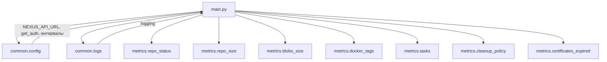
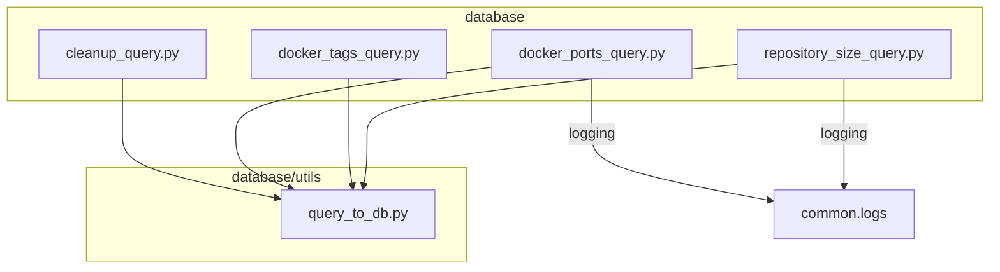

# 📚 Документация проекта

## 📑 Оглавление

- [📚 Документация проекта](#-документация-проекта)
  - [📑 Оглавление](#-оглавление)
  - [📂 Структура проекта](#-структура-проекта)
  - [🚀 `main.py`](#-mainpy)
    - [Назначение](#назначение)
    - [Импорты и зависимости](#импорты-и-зависимости)
    - [Функция `main`](#функция-main)
      - [Логика работы](#логика-работы)
      - [Параметры](#параметры)
      - [Возвращаемое значение](#возвращаемое-значение)
    - [Взаимодействие с другими модулями](#взаимодействие-с-другими-модулями)
    - [Кратко](#кратко)
  - [📦 Папка `common`](#-папка-common)
    - [Файл: `common/config.py`](#файл-commonconfigpy)
      - [Назначение](#назначение-1)
      - [Переменные](#переменные)
      - [Функции](#функции)
        - [`get_auth()`](#get_auth)
    - [Файл: `common/logs.py`](#файл-commonlogspy)
      - [Назначение](#назначение-2)
      - [Основные элементы](#основные-элементы)
      - [Пример использования](#пример-использования)
      - [Связи](#связи)
- [📂 Документация: Папка `database`](#-документация-папка-database)
  - [Файл: `cleanup_query.py`](#файл-cleanup_querypy)
    - [Назначение](#назначение-3)
    - [Функции](#функции-1)
      - [`fetch_cleanup_name()`](#fetch_cleanup_name)
  - [Файл: `docker_ports_query.py`](#файл-docker_ports_querypy)
    - [Назначение](#назначение-4)
    - [Функции](#функции-2)
      - [`fetch_docker_ports()`](#fetch_docker_ports)
  - [Файл: `docker_tags_query.py`](#файл-docker_tags_querypy)
    - [Назначение](#назначение-5)
    - [Функции](#функции-3)
      - [`fetch_docker_tags_data()`](#fetch_docker_tags_data)
  - [Файл: `repository_size_query.py`](#файл-repository_size_querypy)
    - [Назначение](#назначение-6)
    - [Функции](#функции-4)
      - [`get_repository_sizes()`](#get_repository_sizes)
      - [`get_repository_data()`](#get_repository_data)
  - [🔗 Взаимосвязи внутри `database`](#-взаимосвязи-внутри-database)
  - [📦 Папка `metrics`](#-папка-metrics)
  - [Файлы и их функции](#файлы-и-их-функции)
    - [1. `blobs_size.py`](#1-blobs_sizepy)
    - [2. `certificates_expired.py`](#2-certificates_expiredpy)
    - [3. `certificates.py`](#3-certificatespy)
    - [4. `cleanup_policy.py`](#4-cleanup_policypy)
    - [5. `docker_ports.py`](#5-docker_portspy)
    - [6. `docker_tags.py`](#6-docker_tagspy)
    - [7. `repo_size.py`](#7-repo_sizepy)
    - [8. `repo_status.py`](#8-repo_statuspy)
    - [9. `tasks.py`](#9-taskspy)
  - [🔗 Взаимосвязи модулей](#-взаимосвязи-модулей)

---

## 📂 Структура проекта

```
.
├── common
│   ├── config.py          # конфигурация проекта (URL, токены, интервалы)
│   └── logs.py            # единое логирование
├── database
│   ├── cleanup_query.py
│   ├── docker_ports_query.py
│   ├── docker_tags_query.py
│   ├── __init__.py
│   ├── repository_size_query.py
│   └── utils
│       ├── connection.py
│       ├── jobs_reader.py
│       └── query_to_db.py
├── metrics
│   ├── blobs_size.py
│   ├── certificates_expired.py
│   ├── certificates.py
│   ├── cleanup_policy.py
│   ├── docker_ports.py
│   ├── docker_tags.py
│   ├── __init__.py
│   ├── repo_size.py
│   ├── repo_status.py
│   ├── tasks.py
│   └── utils
│       ├── api_gitlab.py
│       ├── api.py
│       └── __init__.py
├── test
│   ├── test_docker_tags.py
│   ├── test_sync_cert.py
│   └── test_task.py
├── Dockerfile
├── main.py                 # точка входа в приложение
├── makefile
├── README.md
└── requirements.txt
```

---

## 🚀 `main.py`

### Назначение
Файл **`main.py`** — это **точка входа** проекта.  
Задачи:
- запуск HTTP-сервера Prometheus (порт `8000`),  
- первичный сбор метрик,  
- запуск бесконечного цикла с периодическим сбором метрик (по разным интервалам),  
- логирование всего процесса.

---

### Импорты и зависимости

- **Стандартные библиотеки**  
  - `time` — управление интервалами между итерациями.

- **Локальные модули**
  - `common.logs.logging` — логирование.  
  - `common.config`  
    - `get_auth()` — возвращает `(username, password)` для Nexus.  
    - `NEXUS_API_URL`, `LAUNCH_INTERVAL`, `REPO_METRICS_INTERVAL` — глобальные настройки.  
  - `metrics.*`  
    - `repo_status.fetch_repositories_metrics` — метрики статуса репозиториев.  
    - `repo_size.fetch_repository_metrics` — метрики размера репозиториев.  
    - `blobs_size.fetch_blob_metrics` — метрики блобов.  
    - `docker_tags.fetch_docker_tags_metrics` — метрики Docker-тегов.  
    - `tasks.fetch_task_metrics` — метрики задач.  
    - `tasks.fetch_all_blob_and_repo_metrics` — метрики повисших задач.  
    - `tasks.fetch_custom_policy_metrics` — метрики кастомных политик.  
    - `cleanup_policy.fetch_cleanup_policy_usage` — метрики политик очистки.  
    - `certificates_expired.fetch_cert_lifetime_metrics` — метрики сертификатов.  

- **Сторонние библиотеки**
  - `prometheus_client.start_http_server` — запуск HTTP-сервера для Prometheus.  

---

### Функция `main`

#### Логика работы
1. **Запуск HTTP-сервера Prometheus**  
   Метрики становятся доступны на `http://localhost:8000`.  

2. **Получение авторизации**  
   ```python
   auth = get_auth()
   ```
   Используется для запросов к Nexus API.  

3. **Первичный сбор метрик**  
   - статусы репозиториев,  
   - политики очистки,  
   - сертификаты,  
   - повисшие задачи,  
   - (опционально) Docker-порты.  

   Это делается сразу, чтобы Prometheus сразу получил актуальные данные.  

4. **Бесконечный цикл**  
   - Проверяет интервал `REPO_METRICS_INTERVAL` и запускает тяжёлые метрики.  
   - Всегда запускает "легковесные" метрики (блобы, теги, задачи).  
   - Ждёт `LAUNCH_INTERVAL` секунд и повторяет процесс.  

#### Параметры
Функция не принимает аргументов.  

#### Возвращаемое значение
Функция ничего не возвращает — это вечный процесс с циклическим сбором метрик.  

---

### Взаимодействие с другими модулями



- **`common.config`** → настройки и авторизация.  
- **`common.logs`** → логирование всех действий.  
- **`metrics.*`** → сбор конкретных групп метрик.  

---

### Кратко
- `main.py` — управляющий модуль.  
- Запускает Prometheus-сервер.  
- Организует запуск всех метрик по расписанию.  
- Основан на `common.config` и `common.logs`.  

---

## 📦 Папка `common`

### Файл: `common/config.py`

#### Назначение
Файл хранит все **настройки проекта**, которые подгружаются из `.env`.  
Позволяет централизованно управлять подключением к Nexus, GitLab, БД и интервалами запуска метрик.

#### Переменные

- **Nexus**
  - `NEXUS_API_URL` — адрес Nexus API.  
  - `NEXUS_USERNAME` — имя пользователя Nexus.  
  - `NEXUS_PASSWORD` — пароль пользователя Nexus.  

- **GitLab**
  - `GITLAB_URL` — адрес GitLab (по умолчанию `https://gitlab.ru`).  
  - `GITLAB_TOKEN` — токен доступа к API GitLab.  
  - `GITLAB_BRANCH` — ветка по умолчанию (по умолчанию `main`).  

- **Прочее**
  - `DATABASE_URL` — строка подключения к базе данных.  
  - `REPO_METRICS_INTERVAL` — интервал (в секундах) для запуска тяжёлых метрик (по умолчанию `1800`).  
  - `LAUNCH_INTERVAL` — интервал (в секундах) для основного цикла сбора метрик (по умолчанию `300`).  

#### Функции

##### `get_auth()`
- **Что делает**: возвращает кортеж `(NEXUS_USERNAME, NEXUS_PASSWORD)` для авторизации в Nexus API.  
- **Параметры**: нет.  
- **Возвращает**: `tuple[str, str]`.  
- **Где используется**: в `main.py` и модулях `metrics/*`.  

---

### Файл: `common/logs.py`

#### Назначение
Единая настройка логирования для всего проекта.  
Позволяет выводить логи в консоль в структурированном виде.  

#### Основные элементы

- **`logging.basicConfig(...)`**  
  Настраивает:
  - Уровень логирования — `INFO`.  
  - Формат логов: `ВРЕМЯ - УРОВЕНЬ - МОДУЛЬ - СООБЩЕНИЕ`.  
  - Обработчик — `StreamHandler`.  

- **`logger = logging.getLogger(current_file)`**  
  Создаёт объект логирования, привязанный к текущему файлу.  

#### Пример использования
```python
from common.logs import logger

logger.info("Запуск сбора метрик")
logger.error("Ошибка подключения к базе данных")
```

#### Связи
- Используется во всех модулях для логирования.  
- Обеспечивает единый стиль логов.  

---

# 📂 Документация: Папка `database`

Модули этой папки предназначены для **работы с базой данных Nexus**.  
Здесь собраны SQL-запросы и утилиты, которые позволяют извлекать информацию о репозиториях, политиках очистки, Docker-тегах и пр.

---

## Файл: `cleanup_query.py`

### Назначение
Получение списка имён политик очистки из БД.

### Функции

#### `fetch_cleanup_name()`
- **Что делает**: выполняет SQL-запрос и возвращает список названий политик очистки (`cleanup_policy`).  
- **SQL-запрос**:
  ```sql
  SELECT name FROM cleanup_policy;
  ```
- **Параметры**: нет.  
- **Возвращает**: список строк (названия политик).  
- **Связи**:  
  - использует `database.utils.query_to_db.fetch_data` для выполнения запроса.  

---

## Файл: `docker_ports_query.py`

### Назначение
Получение информации о **Docker-репозиториях**: имя, HTTP-порт, удалённый URL.

### Функции

#### `fetch_docker_ports()`
- **Что делает**:
  1. Выполняет SQL-запрос для выборки `name` и `attributes` у всех репозиториев с типом `docker-hosted` или `docker-proxy`.  
  2. Для каждого репозитория парсит JSON `attributes`.  
  3. Извлекает:
     - `httpPort` (номер HTTP-порта, если есть),  
     - `remoteUrl` (удалённый адрес, если это proxy).  
  4. Формирует список словарей с данными по каждому репозиторию.
- **SQL-запрос**:
  ```sql
  SELECT r.name, r.attributes
  FROM repository r
  WHERE r.recipe_name IN ('docker-hosted', 'docker-proxy');
  ```
- **Параметры**: нет.  
- **Возвращает**: список словарей формата:  
  ```python
  {
    "repository_name": str,
    "http_port": int | None,
    "remote_url": str | None
  }
  ```
- **Связи**:
  - использует `database.utils.query_to_db.fetch_data` для получения строк,  
  - логирование (`common.logs.logging`) для предупреждений и информации.  

---

## Файл: `docker_tags_query.py`

### Назначение
Получение информации о Docker-тегах, их версиях и привязке к репозиториям.

### Функции

#### `fetch_docker_tags_data()`
- **Что делает**: выполняет SQL-запрос, объединяющий таблицы `docker_component`, `docker_content_repository` и `repository`, чтобы получить список Docker-компонентов и их связь с репозиториями.  
- **SQL-запрос**:
  ```sql
  SELECT
      dc.name,
      dc.version,
      r.name,
      r.recipe_name,
      (r.attributes::jsonb -> 'storage' ->> 'blobStoreName')
  FROM docker_component dc
  JOIN docker_content_repository dcr ON dc.repository_id = dcr.repository_id
  JOIN repository r ON dcr.config_repository_id = r.id;
  ```
- **Параметры**: нет.  
- **Возвращает**: список строк (кортежей), каждая содержит:
  1. имя Docker-компонента,  
  2. его версию,  
  3. имя репозитория,  
  4. тип репозитория (`recipe_name`),  
  5. имя blob-хранилища.  
- **Связи**: использует `database.utils.query_to_db.fetch_data`.  

---

## Файл: `repository_size_query.py`

### Назначение
Получение информации о размере репозиториев и их конфигурации.

### Функции

#### `get_repository_sizes()`
- **Что делает**:
  1. Выполняет вспомогательный SQL-запрос к `pg_catalog.pg_tables`, чтобы найти все таблицы, оканчивающиеся на `_content_repository`.  
  2. Для каждого найденного типа репозитория строит динамический SQL-запрос с помощью `psycopg2.sql.SQL`.  
  3. Считает суммарный размер всех blob’ов по каждому репозиторию.  
  4. Возвращает словарь с данными.  
- **Параметры**: нет.  
- **Возвращает**: словарь `{ repository_name: size_in_bytes }`.  
- **Связи**:
  - использует `database.utils.query_to_db.execute_custom` для выполнения функции с курсором,  
  - логирование через `common.logs.logging`.  

#### `get_repository_data()`
- **Что делает**: возвращает базовую информацию о каждом репозитории:  
  - имя,  
  - формат (`docker`, `maven`, `npm` и т.п.),  
  - тип (`proxy`, `hosted` и т.п.),  
  - blob-хранилище,  
  - привязанная политика очистки.  
- **SQL-запрос**:
  ```sql
  SELECT 
      r.name AS repository_name,
      SPLIT_PART(r.recipe_name, '-', 1) AS format,
      SPLIT_PART(r.recipe_name, '-', 2) AS repository_type,
      r.attributes->'storage'->>'blobStoreName' AS blob_store_name,
      COALESCE(r.attributes->'cleanup'->>'policyName', '') AS cleanup_policy
  FROM repository r
  ORDER BY format, repository_type, repository_name;
  ```
- **Параметры**: нет.  
- **Возвращает**: список словарей:
  ```python
  {
    "repository_name": str,
    "format": str,
    "repository_type": str,
    "blob_store_name": str,
    "cleanup_policy": str
  }
  ```
- **Связи**:
  - использует `database.utils.query_to_db.fetch_data`.  

---

## 🔗 Взаимосвязи внутри `database`




---

## 📦 Папка `metrics`

Полная документация по модулям папки `metrics`, отвечающим за сбор и обновление метрик Prometheus для Nexus.

---

## Файлы и их функции

### 1. `blobs_size.py`

* Сбор метрик использования blobstore.
* Метрики:

  * `nexus_blob_storage_usage` — занятость/свободное место.
  * `nexus_blob_quota` — квота blobstore.
* Основные функции:

  * `get_blobstores(nexus_url, auth)` — получает список blobstore из Nexus API.
  * `get_quota(data)` — извлекает квоту blobstore.
  * `update_metrics(blobstores)` — обновляет Prometheus метрики.
  * `fetch_blob_metrics(nexus_url, auth)` — основной метод для получения и обновления метрик.

### 2. `certificates_expired.py`

* Сбор метрик о сроке действия сертификатов SSL в truststore.
* Метрика: `nexus_cert_days_left`.
* Основные функции:

  * `clean_pem(pem)` — очищает сертификат от лишних символов.
  * `short_pem(pem)` — сокращает сертификат для отображения.
  * `fetch_cert_lifetime_metrics(nexus_url, auth)` — собирает метрики дней до истечения сертификата.

### 3. `certificates.py`

* Проверка совпадения SSL-сертификатов с remote URL proxy-репозиториев.
* Метрика: `nexus_cert_url_match`.
* Основные функции:

  * `match_level(cert_cn, remote_url)` — определяет уровень совпадения.
  * `update_cert_match_metrics(nexus_url, auth)` — обновляет метрики совпадений.

### 4. `cleanup_policy.py`

* Проверка использования политик очистки.
* Метрика: `nexus_cleanup_policy_used`.
* Основная функция: `fetch_cleanup_policy_usage(api_url, auth)`.

### 5. `docker_ports.py`

* Метрики Docker-портов и их статусов.
* Метрики: `docker_repository_port_info`, `docker_port_status`.
* Основные функции:

  * `extract_ports(file_text)` — извлекает порты из скриптов.
  * `map_ports_to_endpoints(nginx_conf)` — сопоставляет порты с эндпоинтами.
  * `get_docker_repositories(nexus_url, auth)` — получает список Docker-репозиториев.
  * `fetch_docker_ports(nexus_url, auth)` — основной сбор метрик.

### 6. `docker_tags.py`

* Сбор информации о Docker-образах и их тегах.
* Метрика: `docker_image_tags_info`.
* Основные функции:

  * `process_docker_result(result)` — группировка данных по образам и тегам.
  * `fetch_docker_tags_metrics()` — обновление Prometheus метрик.

### 7. `repo_size.py`

* Метрики размера репозиториев и задач по blobStore.
* Метрика: `nexus_repo_size`.
* Основная функция: `fetch_repository_metrics()`.

### 8. `repo_status.py`

* Проверка статусов proxy-репозиториев и их remote URL.
* Метрики: `nexus_proxy_repo_status`, `nexus_repo_count`.
* Основные функции:

  * `check_url_status(name, url, auth, check_dns)` — проверка доступности URL.
  * `fetch_status(repo, auth)` — проверка статуса репозитория.
  * `fetch_repositories_metrics(nexus_url, auth)` — основной сбор метрик.

### 9. `tasks.py`

* Метрики задач Nexus и кастомных политик.
* Метрики: `nexus_task_info`, `nexus_task_match_info`, `nexus_custom_policy_expired`.
* Основные функции:

  * `fetch_task_metrics(NEXUS_API_URL, auth)` — сбор всех задач.
  * `fetch_all_blob_and_repo_metrics(NEXUS_API_URL, auth)` — сбор blob/repo задач.
  * `fetch_custom_policy_metrics(NEXUS_API_URL, auth)` — проверка кастомных политик.

---

## 🔗 Взаимосвязи модулей

```mermaid
flowchart TD
    subgraph Metrics[metrics]
        BLOB[blobs_size.py]
        CERT_EXP[certificates_expired.py]
        CERT[certificates.py]
        CP[cleanup_policy.py]
        DP[docker_ports.py]
        DT[docker_tags.py]
        RSZ[repo_size.py]
        RST[repo_status.py]
        TASK[tasks.py]
    end

    subgraph Utils[metrics/utils]
        API[api.py]
        GIT[api_gitlab.py]
    end

    subgraph DB[database]
        CU_DB[cleanup_query.py]
        DT_DB[docker_tags_query.py]
        RS_DB[repository_size_query.py]
        JOBS_DB[jobs_reader.py]
    end

    CP --> API
    CP --> CU_DB
    DP --> API
    DP --> GIT
    DT --> API
    DT --> DT_DB
    RSZ --> RS_DB
    RSZ --> JOBS_DB
    RSZ --> GIT
    RST --> API
    TASK --> API
    TASK --> JOBS_DB
    TASK --> GIT

    BLOB --> API
    CERT_EXP --> API
    CERT --> API

    CP -->|logging| L[common.logs]
    DP -->|logging| L
    DT -->|logging| L
    RSZ -->|logging| L
    RST -->|logging| L
    TASK -->|logging| L
    BLOB -->|logging| L
    CERT_EXP -->|logging| L
    CERT -->|logging| L
```



